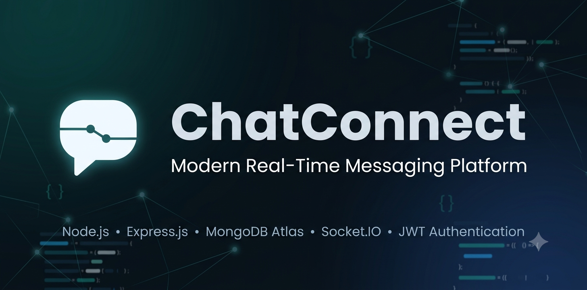
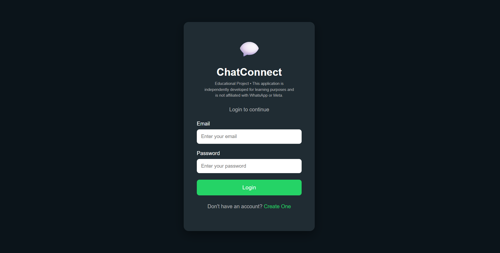
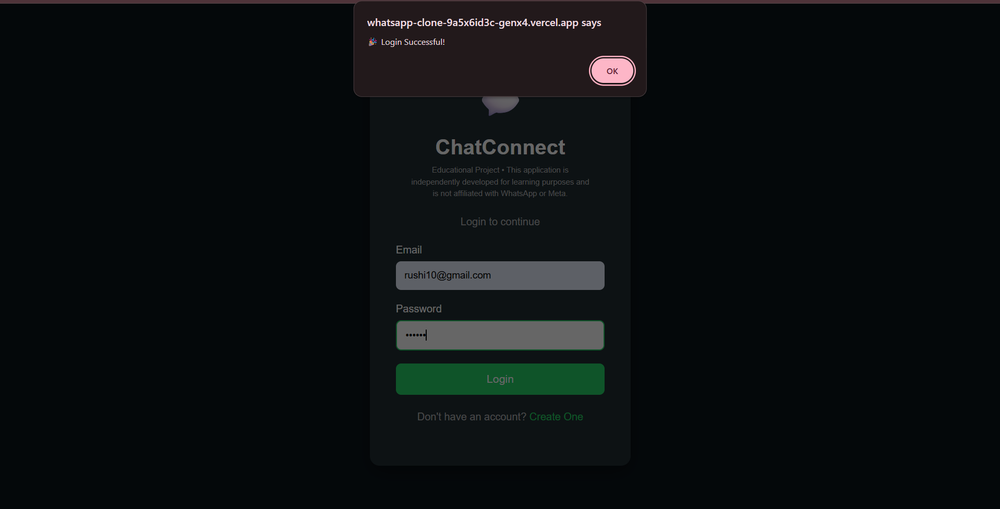
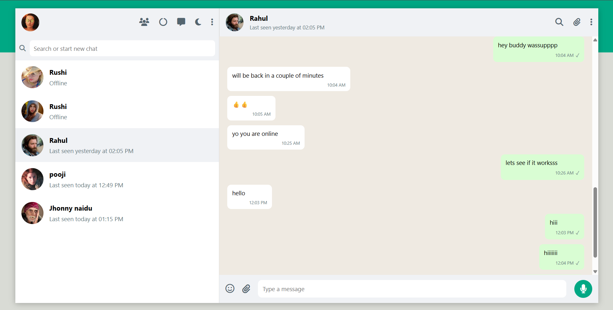
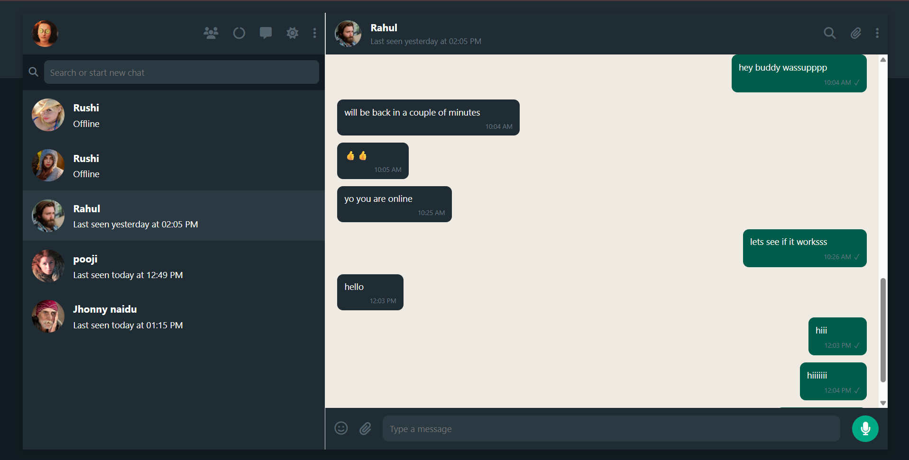

<p align="center">
  
</p>

<h1 align="center">💬 ChatConnect</h1>

<p align="center">

A modern real-time messaging platform built with **Node.js**, **Express.js**, **MongoDB Atlas**, and **Socket.IO**.

Secure • Fast • Responsive • Cloud Deployed

</p>

---

## 🚀 Live Demo

### 🌐 Frontend (Vercel)

https://whatsapp-clone-five-dusky.vercel.app

### ⚙ Backend (Render)

https://whatsapp-clone-una6.onrender.com

---

## 📖 About

**ChatConnect** is a full-stack real-time messaging application developed for educational purposes.

It provides secure authentication, instant messaging, online user tracking, last seen functionality, dark mode, emoji support, and responsive UI while demonstrating modern full-stack development practices.

> **Disclaimer**
>
> This project is independently developed for learning purposes and is **not affiliated with WhatsApp or Meta**.

---

# ✨ Features

- 🔐 JWT Authentication
- 🔒 Password Encryption using bcrypt
- 👤 User Registration & Login
- 💬 Real-Time Messaging with Socket.IO
- 🟢 Online / Offline Status
- 🕒 Last Seen Tracking
- 😀 Emoji Picker
- 🌙 Dark Mode
- 📱 Responsive Design
- 🔍 User Search
- 🔄 Auto Conversation Creation
- ☁ Cloud Deployment
- 🗄 MongoDB Atlas Database

---

# 🛠 Tech Stack

## Frontend

- HTML5
- CSS3
- JavaScript (ES6)

## Backend

- Node.js
- Express.js

## Database

- MongoDB Atlas
- Mongoose

## Authentication

- JWT
- bcrypt

## Real-Time Communication

- Socket.IO

## Deployment

- Vercel
- Render

---

# 📸 Screenshots

## Login Page

<p align="center">

</p>

---

## Login Successful

<p align="center">

</p>

---

## Chat Interface (Light Mode)

<p align="center">

</p>

---

## Chat Interface (Dark Mode)

<p align="center">

</p>

---

# 🏗 Project Structure

```
ChatConnect
│
├── client
│   ├── css
│   ├── js
│   ├── images
│   ├── icons
│   ├── uploads
│   ├── index.html
│   ├── login.html
│   └── signup.html
│
├── server
│   ├── config
│   ├── controllers
│   ├── middleware
│   ├── models
│   ├── routes
│   └── server.js
│
├── assets
├── package.json
└── README.md
```

---

# ⚙ System Architecture

```
                Client (HTML/CSS/JS)
                         │
                         │
              REST API + Socket.IO
                         │
                Express.js Server
                  │            │
                  │            │
              MongoDB      Socket.IO
               Atlas        Server
```

---

# 🚀 Installation

## Clone Repository

```bash
git clone https://github.com/rushi2316/chatconnect.git
```

---

## Navigate

```bash
cd chatconnect
```

---

## Install Dependencies

```bash
npm install
```

---

## Configure Environment Variables

Create a `.env` file in the root directory.

```env
PORT=3000

MONGO_URI=Your MongoDB Atlas Connection String

JWT_SECRET=YourSecretKey
```

---

## Start the Server

```bash
npm start
```

or

```bash
npm run dev
```

---

Visit

```
http://localhost:3000
```

---

# 🔒 Authentication Flow

```
User

↓

Signup

↓

Password Encrypted (bcrypt)

↓

MongoDB

↓

Login

↓

JWT Generated

↓

Browser Local Storage

↓

Authenticated Requests
```

---

# 💬 Messaging Flow

```
Sender

↓

Socket.IO

↓

Express Server

↓

MongoDB

↓

Receiver

↓

Instant Update
```

---

# 🌟 Highlights

- Secure JWT Authentication
- MongoDB Atlas Integration
- Real-Time Socket Communication
- Online Presence Detection
- Last Seen Feature
- Clean Responsive UI
- Dark Mode Support
- Emoji Integration
- RESTful APIs
- Cloud Deployment

---

# 🚀 Future Enhancements

- [x] Authentication
- [x] Real-Time Chat
- [x] Online Status
- [x] Last Seen
- [x] Emoji Picker
- [x] Dark Mode

### Planned Features

- [ ] Group Chats
- [ ] Voice Calling
- [ ] Video Calling
- [ ] File Sharing
- [ ] Image Messages
- [ ] Read Receipts
- [ ] Push Notifications
- [ ] Message Reactions
- [ ] Typing Indicator
- [ ] End-to-End Encryption

---

# 📊 Project Status

✅ Completed

Currently deployed and fully functional.

---

# 👨‍💻 Author

**Rushi Mahidhar**

Computer Science Undergraduate

SRM University AP

GitHub:

https://github.com/rushi2316

---

# ⭐ Support

If you found this project helpful,

please consider giving it a ⭐ on GitHub.

It really helps!

---

## 📜 License

This project is licensed under the MIT License.

Developed for educational and portfolio purposes.